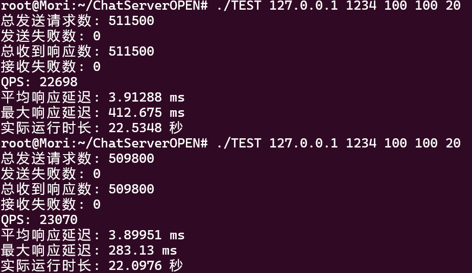

## 核心性能指标

 在客户端模拟**10000**并发连接数下:

- **QPS (每秒请求数)**: 20000+，较高的并发处理能力
- **平均响应延迟**: 3 ~ 4 ms，响应速度极快
- **最大响应延迟**: 500ms以下，在高并发下仍保持合理延迟
- **零丢包**: 发送失败数和接收失败数均为0，系统稳定性极佳
- **吞吐量**: 文件传输速率达**200MB/s+**,接近本地TCP处理极限
